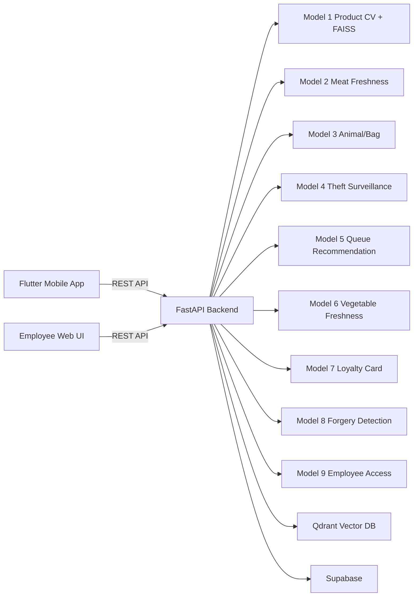

# BaronsMarket AI Platform - Smart Retail Analytics, Computer Vision, Mobile & Web


## Overview
BaronsMarket AI Platform is an end-to-end **retail intelligence** project combining:
- **Mobile shopping assistant** (product detection, cart, checkout)
- **Employee web operations panel** (security AI, queue optimization, store analytics BI)
- **Multi-model AI backend** (computer vision, OCR, face verification, recommendation)

Keywords: `retail analytics`, `computer vision`, `FastAPI`, `Flutter`, `YOLO`, `TensorFlow`, `PyTorch`, `Qdrant`, `Supabase`, `automation`, `API`, `dashboard`, `data processing`.

## Features
1. Product detection and retrieval (Model 1)
2. Meat freshness classification (Model 2)
3. Animal & bag monitoring from image/video (Model 3)
4. Theft surveillance with event capture (Model 4)
5. Queue recommendation and best checkout lane (Model 5)
6. Vegetable freshness classification (Model 6)
7. Loyalty card verification (Model 7)
8. Forgery document verification + mask/heatmap (Model 8)
9. Employee access verification (liveness + badge + face match) (Model 9)
10. AI assistant for shopping/cart decisions
11. Store analytics BI (candles, trends, top products, stock risk, agent insights)
12. Semantic product search and recommendation via Qdrant

## Tech Stack
### Frontend
- **Flutter** (Android customer app)
- **HTML/CSS/JavaScript** (Employee web interface)

### Backend
- **FastAPI** + Pydantic
- **Python** services architecture
- REST APIs for mobile, web, and model orchestration

### AI/ML & Data
- **YOLO**, **PyTorch**, **TensorFlow**
- **OpenCV**, OCR pipeline
- **FAISS** (vector similarity for product retrieval)
- **Qdrant** (vector database for semantic recommendations)
- **Supabase** (cloud persistence: checkout sessions, face embeddings)

## Architecture


## Model Details
1. **Model 1 - Product Detection & Retrieval**
- Detects product candidates from shelf/cart image
- Uses embeddings + FAISS to retrieve nearest products
- Output: name, brand, price, confidence, image

2. **Model 2 - Meat Freshness**
- Image-based freshness classifier for meat
- Output: label + probabilities

3. **Model 3 - Animal & Bag**
- Image and video inference for `animal` / `bag`
- Event extraction with timestamps and snapshots

4. **Model 4 - Theft Surveillance**
- Person detection + behavior/theft decision pipeline
- States: `NORMAL`, `SUSPECT`, `THEFT`
- Auto-capture artifacts for suspicious events

5. **Model 5 - Queue Recommendation**
- Counts people per queue zone from CCTV video
- Computes best queue recommendation
- Supports async job processing and live polling

6. **Model 6 - Vegetable Freshness**
- Freshness classification for produce images
- Output: label + probabilities

7. **Model 7 - Loyalty Card Verification**
- Card validity + OCR extraction + model confidence
- Returns discount and card identity fields

8. **Model 8 - Forgery Documents**
- Forged vs authentic prediction
- Returns score/threshold, mask, and heatmap
- Integrated with JPEG-aware preprocessing

9. **Model 9 - Employee Access**
- Liveness check + expected badge keyword check
- Face registration and face matching
- Uses Supabase table (fallback local storage)

## Directory Structure
```text
.
├── backend/                     # FastAPI APIs + services
│   ├── app/
│   │   ├── main.py             # API routes
│   │   ├── core/config.py      # env configuration
│   │   └── services/           # business + model services
│   └── requirements.txt
├── frontend/                    # Flutter mobile app
├── apps/web-employee/           # Employee web dashboard
├── model/                       # model assets and configs
├── ml/models/                   # model code/weights by module
└── market/                      # product catalog data
```

## Getting Started
### 1) Prerequisites
- Python `3.10+`
- Flutter SDK
- Qdrant & Supabase accounts

### 2) Backend Setup
```powershell
cd backend
python -m venv ..\venv
..\venv\Scripts\activate
pip install -r requirements.txt
copy .env.example .env
uvicorn app.main:app --host 0.0.0.0 --port 8000
```

### 3) Mobile App
```powershell
cd frontend
flutter run --dart-define=API_BASE_URL=http://<YOUR_IP>:8000
```

## Source Data
The large product catalog and market data (`market/` folder) is not included in this repository due to its size (+8GB). You can download the complete dataset from Kaggle:
- **Kaggle Dataset**: [BaronsMarket Dataset](https://www.kaggle.com/datasets/omarfkihhassen/baronsmarket)

## Complete Execution Details
To run the full BaronsMarket AI Platform, follow these steps in order:

### 1. Vector Database (Qdrant)
- Start a Qdrant instance (Docker or Cloud).
- Create a collection named `baronsmarket`.
- (Optional) Use the ingestion script in `ml/` to populate the database with product embeddings.

### 2. Backend (FastAPI)
- Configure `.env` with your API keys (OpenAI, Supabase, Qdrant).
- Install dependencies: `pip install -r backend/requirements.txt`.
- Run the server: `uvicorn app.main:app --host 0.0.0.0 --port 8000`.

### 3. Web Dashboard (Employee)
- The web interface is served directly by the backend at `http://localhost:8000/employee/`.
- Access different AI modules (Surveillance, Queue, Forgery, etc.) from the navigation bar.

### 4. Mobile Application (Flutter)
- Update `API_BASE_URL` in your build configuration to point to your backend IP.
- Run `flutter pub get`.
- Launch the app: `flutter run`.

### 5. AI Models
- Ensure model weights (`.pt`, `.pth`, `.h5`) are placed in their respective folders under `ml/models/` or `model/`.
- The backend will automatically load models on demand. For faster inference, a CUDA-enabled GPU is recommended.

## Acknowledgments
- Open-source communities behind FastAPI, Flutter, PyTorch, TensorFlow, Qdrant, Supabase.
- Team contributors for model training, integration, and QA.
