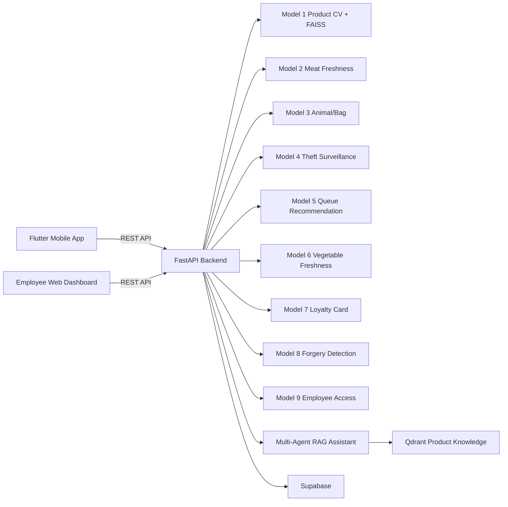
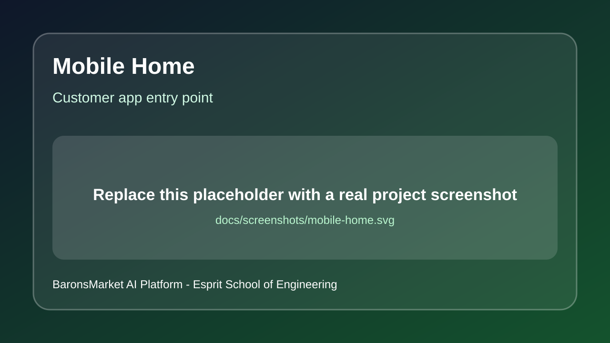
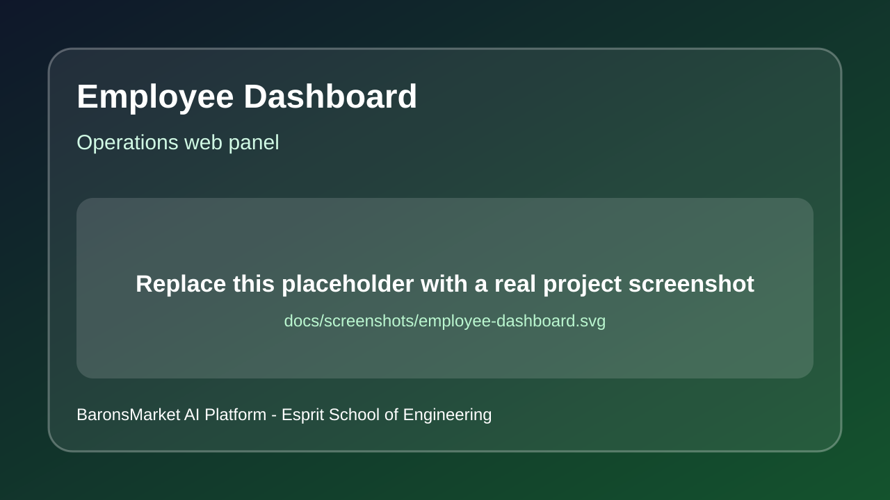
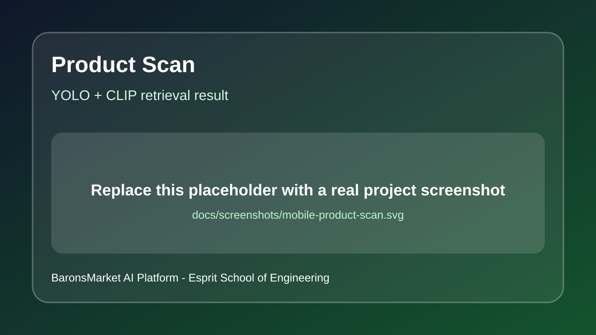
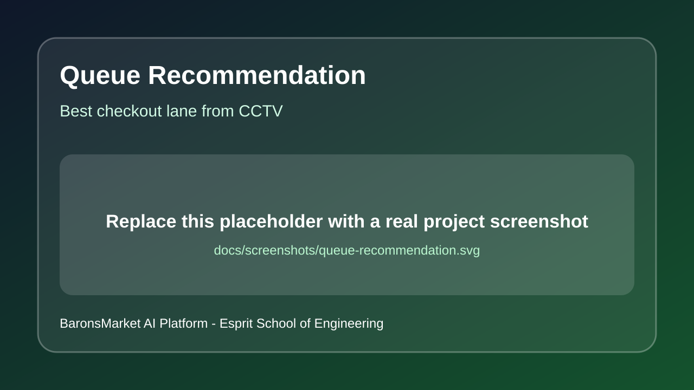
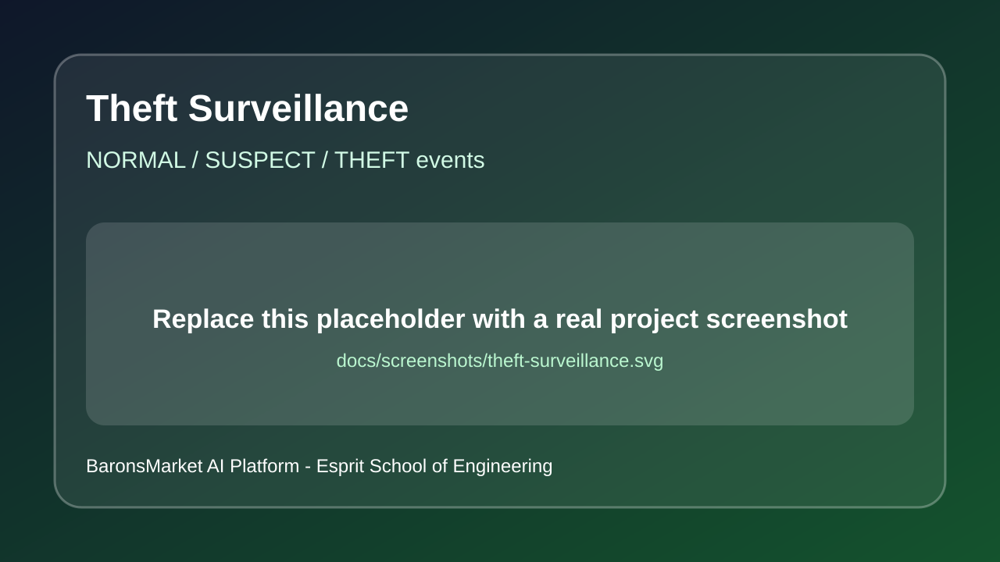
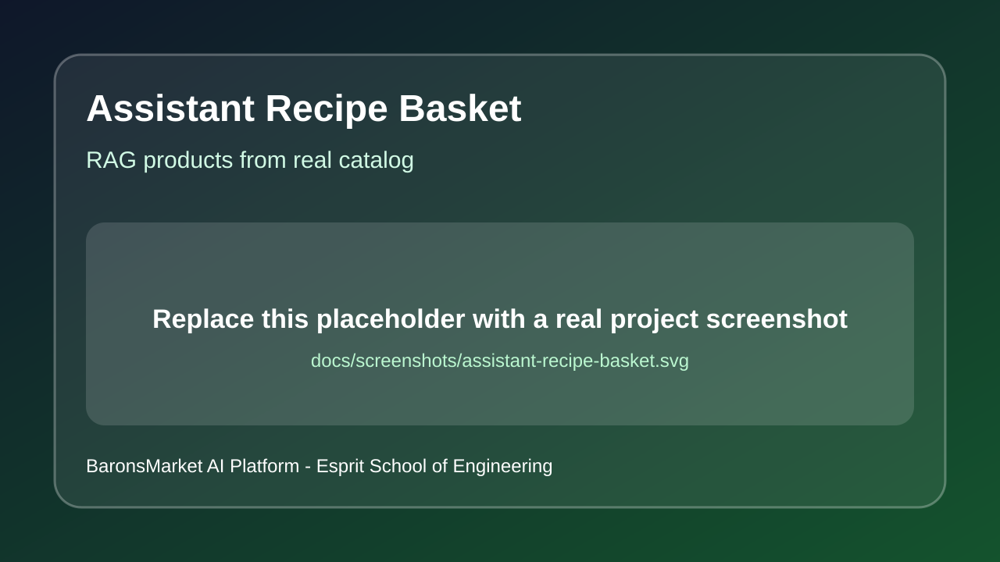
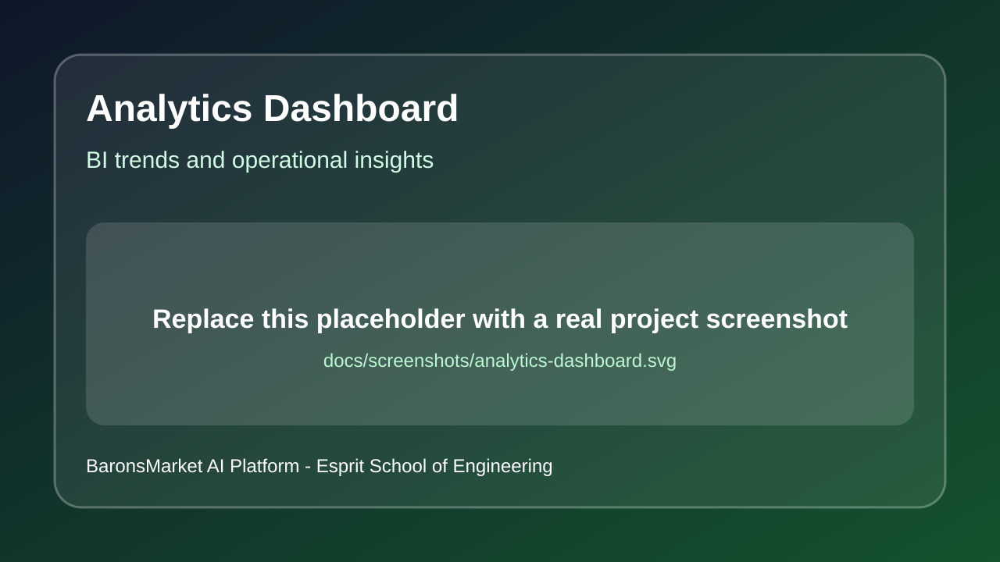
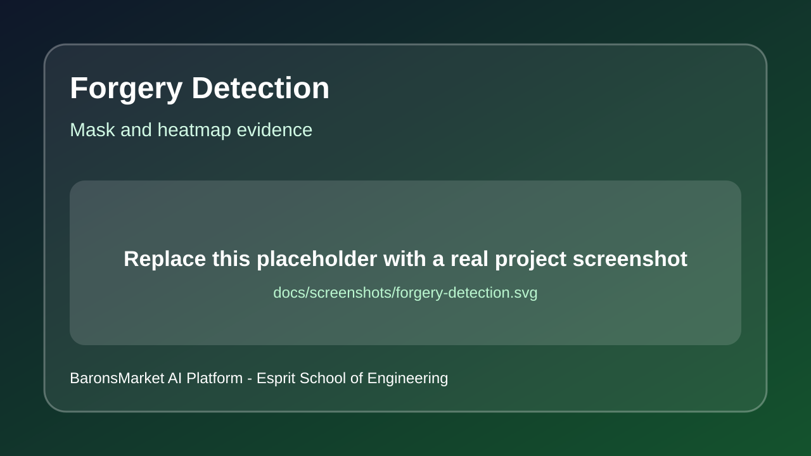

# BaronsMarket AI Platform


## Overview

BaronsMarket AI Platform is an academic smart-retail project developed as part of the **PIDEV / integrated engineering coursework at Esprit School of Engineering**. The project explores how artificial intelligence can support a supermarket environment through customer assistance, employee decision support, computer vision monitoring, semantic product search, and business analytics.

The goal is not to replace staff. The system is designed as an ethical AI decision-support tool that helps customers shop faster and helps employees monitor queues, freshness, access control, and operational signals with better visibility.

In three short points, the system provides:

- A Flutter mobile shopping assistant for product scanning, cart management, checkout, and AI-assisted product recommendations.
- A FastAPI AI backend that orchestrates multiple computer-vision, OCR, RAG, and analytics services.
- An employee web dashboard for theft surveillance, queue recommendation, document verification, employee access, and store analytics.

## Academic Context

- Institution: **Esprit School of Engineering**
- Course/university context: this project was developed as part of the coursework for **PIDEV / integrated engineering project at Esprit School of Engineering**
- Context: university engineering project in AI, software engineering, computer vision, mobile development, and smart retail systems
- Project theme: AI-assisted supermarket operations and customer experience
- Main objective: demonstrate a complete full-stack AI platform combining mobile, web, backend APIs, computer vision, RAG, vector search, and analytics

## GitHub Topics

Recommended GitHub repository topics:

`computer-vision`, `machine-learning`, `deep-learning`, `fastapi`, `flutter`, `pytorch`, `yolo`, `qdrant`, `supabase`, `rag`, `retail-analytics`, `smart-retail`, `mobile-app`, `dashboard`, `ocr`, `cuda`, `ai-assistant`

If topics are not visible on the GitHub repository page, add them from:

`Repository page -> About -> Settings gear -> Topics`

This section is intentionally separate from normal README keywords because GitHub Topics must also be configured on the repository page for evaluation visibility.

## Hosting And Deployment

The backend is deployment-ready for a GPU server. During development, the project was tested locally and exposed temporarily with Cloudflare Tunnel for mobile and remote demonstrations.

Planned/target deployment:

- Backend/API: Hetzner GPU server or any CUDA-capable Linux/Windows server
- Temporary demo access: Cloudflare Tunnel during evaluation sessions
- Database services: Supabase
- Vector search: Qdrant
- Mobile app: Android APK built from Flutter
- Employee dashboard: served by FastAPI at `/employee/`

Important runtime check after deployment:

```powershell
curl http://<server-host>:8000/models/device
```

Expected on GPU server:

```json
{
  "torch_device": "cuda",
  "yolo_device": 0,
  "cuda_available": true
}
```

## Features

1. Product detection and retrieval with YOLO, CLIP embeddings, and FAISS.
2. Meat freshness classification.
3. Animal and bag monitoring from images and videos.
4. Theft surveillance with person tracking, suspect/theft status, and event captures.
5. Queue recommendation with live async processing and best checkout lane selection.
6. Vegetable freshness classification.
7. Loyalty card verification with OCR and CNN classification.
8. Forged document verification with mask and heatmap output.
9. Employee access verification with liveness, badge text, and face matching.
10. Multi-agent RAG shopping assistant using product catalog context and Qdrant retrieval.
11. Store analytics dashboard with trends, top products, stock risk, and agent insights.
12. CUDA-aware model runtime for GPU acceleration.

## Model Descriptions

| Model / Service | Service file | Main role | Output |
| --- | --- | --- | --- |
| Product Retrieval | `backend/app/services/product_retrieval_service.py` | Detects products in an image with YOLO, builds CLIP embeddings, and retrieves the closest catalog products with FAISS. | Product name, brand, price, image, detector confidence, retrieval confidence. |
| Meat Freshness | `backend/app/services/meat_freshness_service.py` | Classifies meat freshness from an uploaded image. | Freshness label and class probabilities. |
| Animal & Bag Monitoring | `backend/app/services/animal_bag_service.py` | Detects animal/bag events from image or video input and extracts event snapshots. | Label, confidence, bounding box, timestamped events. |
| Theft Surveillance | `backend/app/services/theft_surveillance_service.py` | Tracks people in video, analyzes person crops, and classifies behavior states. CUDA batching is used when available. | `NORMAL`, `SUSPECT`, `THEFT`, event captures, suspect face artifacts. |
| Queue Recommendation | `backend/app/services/queue_recommendation_service.py` | Counts people in configured checkout zones and recommends the best queue. | Queue counts, best queue, async job status, output video path. |
| Vegetable Freshness | `backend/app/services/vegetable_freshness_service.py` | Classifies vegetable/produce freshness with a MobileNet-based PyTorch model. | Healthy/rotten label and probabilities. |
| Fidelity Card Verification | `backend/app/services/fidelity_card_service.py` | Validates customer loyalty card using CNN classification, OCR, expiry/status checks, and local database lookup. | Validity, discount, card ID, customer name, OCR pass. |
| Forged Document Detection | `backend/app/services/forged_docs_service.py` | Detects potential forged document regions and generates visual evidence. | Authentic/forged decision, score, mask, heatmap, original preview. |
| Employee Access | `backend/app/services/employee_access_service.py` | Combines liveness check, badge text verification, face registration, and face matching. | Access decision, employee identity, liveness result, face match score. |
| Multi-Agent RAG Assistant | `backend/app/services/assistant_service.py` | Routes user messages to specialized agents and retrieves real products from catalog/Qdrant context. | Detailed answer, steps, active agent, product cards from catalog. |
| Store Analytics | `backend/app/services/store_analytics_service.py` | Builds BI-style operational insights from checkout and product data. | Trends, top products, stock risk, recommendation insights. |

## AI Assistant And RAG

The assistant uses a multi-agent architecture:

- General agent: friendly shopping assistant, product search, recommendations, basket help.
- Chef agent: recipe assistant that prepares a complete ingredient basket from real catalog products.
- Nutrition agents: general and baby nutrition guidance with product-aware recommendations.
- Support agent: application, checkout, cart, and user support.
- Router agent: routes the user request to the right specialist agent.
- Search translator agent: converts natural language into precise Qdrant/catalog queries.
- Product resolver: combines semantic search and catalog ranking.

The assistant is constrained to recommend products that exist in the available catalog context. For recipes, the displayed products are ingredients for the recipe basket, not random alternatives.

## Tech Stack

### Frontend

- Flutter Android app
- HTML/CSS/JavaScript employee dashboard

### Backend

- FastAPI
- Pydantic / pydantic-settings
- REST APIs for mobile, web, and AI model orchestration

### AI, ML, And Data

- PyTorch with CUDA support
- Ultralytics YOLO
- OpenCV
- CLIP embeddings
- FAISS
- Qdrant vector database
- Supabase persistence
- EasyOCR / OCR pipelines
- RAG-style multi-agent assistant

## Architecture



## Screenshots And Demo Assets

Suggested demo screenshots are documented in `docs/screenshots/README.md`.

Recommended visuals for evaluation:

- Mobile home/product scan screen
- Mobile cart and checkout QR screen
- Employee web dashboard home
- Queue recommendation video result
- Theft surveillance event capture
- Forgery detection mask/heatmap
- Store analytics dashboard
- Assistant recipe/product basket response

Screenshot gallery placeholders are already included. Replace these files with real screenshots before final submission:

| Mobile | Employee / AI |
| --- | --- |
|  |  |
|  |  |
|  |  |
|  |  |
|  |  |

If a stable live demo URL is available, add it here:

- Live backend health: `http://<server-host>:8000/health`
- Employee dashboard: `http://<server-host>:8000/employee/`
- Device/GPU check: `http://<server-host>:8000/models/device`

## Directory Structure

```text
.
|-- backend/                     # FastAPI APIs + model services
|   |-- app/
|   |   |-- main.py              # API routes
|   |   |-- core/config.py       # environment configuration
|   |   `-- services/            # assistant, model, data services
|   `-- requirements.txt
|-- frontend/                    # Flutter mobile app
|-- apps/web-employee/public/    # Employee dashboard
|-- model/                       # model assets and configs
|-- ml/models/                   # model code/weights by module
|-- market/                      # product catalog data
`-- docs/                        # documentation and screenshot notes
```

## API Highlights

- `GET /health`
- `GET /models/device`
- `POST /detect`
- `POST /assistant/chat`
- `POST /checkout/save`
- `POST /meat-freshness`
- `POST /vegetable-freshness`
- `POST /model3/predict-image`
- `POST /model3/analyze-video`
- `POST /theft/submit-video`
- `GET /theft/job-latest`
- `GET /theft/latest`
- `POST /queue-recommendation/submit-video`
- `GET /queue-recommendation/job-latest`
- `GET /queue-recommendation/latest`
- `POST /fidelity/verify`
- `POST /model8/verify-doc`
- `POST /model9/register-face`
- `POST /model9/verify-access`
- `GET /analytics/store`

## Getting Started

### Prerequisites

- Python 3.10+ recommended
- Git and Git LFS
- Flutter SDK and Android Studio
- CUDA-capable GPU recommended for video models
- Optional: `ffmpeg`, `yt-dlp` for YouTube/video flows

### 1. Clone

```powershell
git clone -b integration https://github.com/omarfh111/BaronsMarket.git
cd BaronsMarket
git lfs pull
```

### 2. Backend Setup

```powershell
cd backend
python -m venv ..\venv
..\venv\Scripts\activate
pip install -r requirements.txt
copy .env.example .env
```

### 3. CUDA Check

```powershell
python -c "import torch; print(torch.__version__); print(torch.cuda.is_available()); print(torch.cuda.get_device_name(0) if torch.cuda.is_available() else 'CPU')"
```

### 4. Run Backend

```powershell
uvicorn app.main:app --host 0.0.0.0 --port 8000
```

Open:

- `http://127.0.0.1:8000/health`
- `http://127.0.0.1:8000/models/device`
- `http://127.0.0.1:8000/employee/`

### 5. Mobile App Setup

```powershell
cd ..\frontend
flutter pub get
flutter doctor
```

Run on phone on the same network:

```powershell
flutter run --dart-define=API_BASE_URL=http://<PC_LOCAL_IP>:8000
```

Build APK:

```powershell
flutter build apk --release --dart-define=API_BASE_URL=http://<PC_LOCAL_IP>:8000
```

## Environment Variables

Main variables:

- `MODEL_DEVICE=auto` or `cuda` or `cpu`
- `OPENAI_API_KEY`, `OPENAI_MODEL`, `OPENAI_EMBEDDING_MODEL`
- `SUPABASE_URL`, `SUPABASE_SERVICE_ROLE_KEY`, `SUPABASE_CHECKOUT_TABLE`
- `QDRANT_URL`, `QDRANT_API_KEY`, `QDRANT_COLLECTION_NAME`
- `MODEL4_PERSON_WEIGHTS_PATH`, `MODEL4_THEFT_WEIGHTS_PATH`
- `MODEL5_WEIGHTS_PATH`, `MODEL5_QUEUE_ZONES_PATH`, `MODEL5_OUTPUT_DIR`
- `MODEL8_*` for forged document detection
- `MODEL9_*` for employee access verification

## Ethical AI And Sustainable Development Goals

This project supports ethical AI use by assisting humans instead of replacing them. It does not eliminate the work of cashiers, employees, security staff, or managers; it gives them extra information, faster alerts, and better decision support. Final decisions remain human-centered: employees can verify recommendations, reject false alerts, and use the system as a tool rather than as an autonomous replacement.

Relevant UN Sustainable Development Goals (ODD):

- SDG 3: Good Health and Well-being, through freshness checks and safer food-quality awareness.
- SDG 4: Quality Education, through an academic engineering project that applies AI, software engineering, and responsible innovation.
- SDG 8: Decent Work and Economic Growth, through decision-support tools for retail operations.
- SDG 9: Industry, Innovation and Infrastructure, through AI and software engineering integration.
- SDG 10: Reduced Inequalities, through an assistant that can simplify access to product information and shopping guidance.
- SDG 11: Sustainable Cities and Communities, through smarter local retail services and safer store operations.
- SDG 12: Responsible Consumption and Production, through freshness checks, product awareness, and analytics.

## Troubleshooting

1. Queue stays `N/A`
- Check queue zone coordinates and camera perspective.

2. CUDA not used
- Verify the backend runs with the Python environment that has CUDA PyTorch installed.
- Check `GET /models/device`.

3. Cloudflare Tunnel request canceled
- Use async video endpoints and avoid very large synchronous uploads.

4. Face recognition import error
- Verify `face_recognition`, `face_recognition_models`, and build tools.

5. Assistant returns weak recommendations
- Verify Qdrant credentials and product catalog indexing.

## Acknowledgments

This project was developed in an academic context at **Esprit School of Engineering**.

Special thanks to:

- Esprit School of Engineering for the academic framework and engineering training environment.
- The supervising professor and evaluators for guidance, feedback, and project review.
- Open-source communities behind FastAPI, Flutter, PyTorch, YOLO, Qdrant, Supabase, OpenCV, and FAISS.
- Team contributors responsible for model training, backend integration, mobile development, web dashboard development, and testing.
